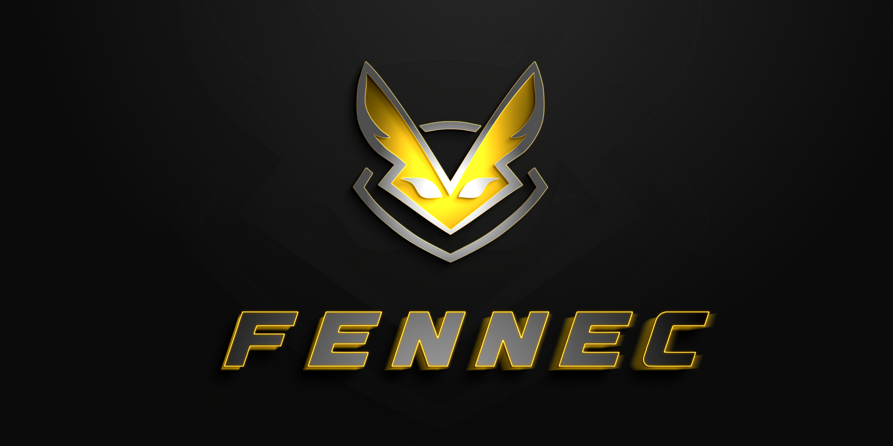
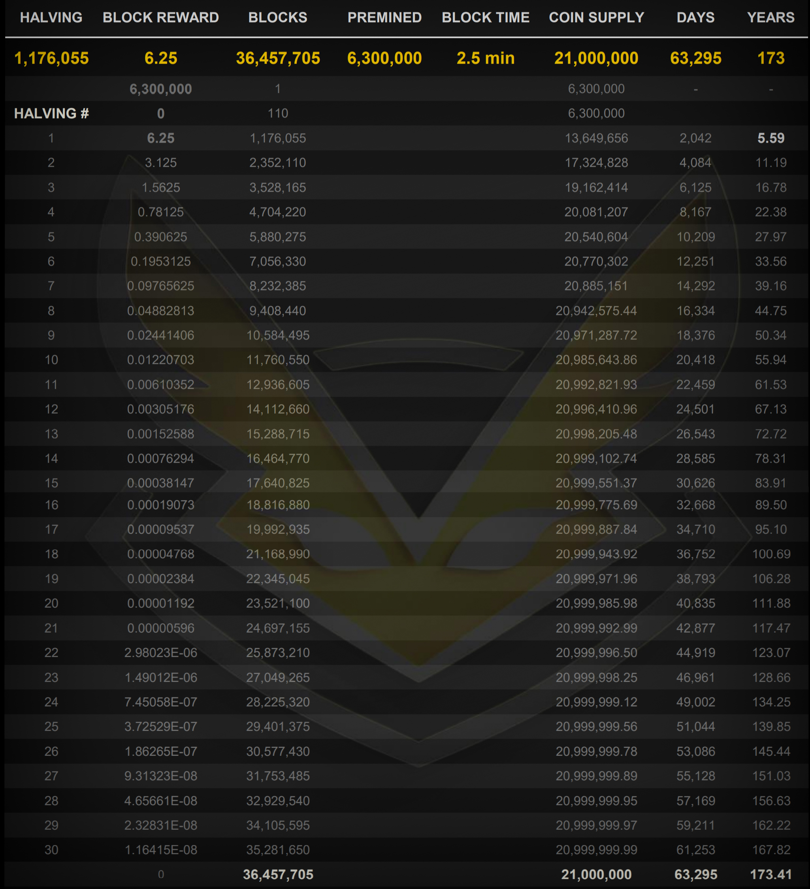

Specifications:
==================

---

• 51% attacks resistant

• Adopts Segwit and CSV technology

• Prefix: FNNC adresses start with "F"  

• Uses the DarkGravity v3 (written by Evan Duffield) difficulty algorithm for a more stable POW mining on the network

---

Reward Table:
==================

Links:
==================

• [Website](https://fennecblockchain.com/)

• [Telegram - Official](https://t.me/FennecPortal)

• [Telegram - Mining](https://t.me/FennecMiningPortal)

• [Discord](https://discord.gg/HUepGGUKW4)

• [Explorer](https://scan.fennecblockchain.com/)

• [Mining Pool](https://mine.fennecblockchain.com)

• [Web Wallet](https://fennecwallet.com)

• [Android Wallet](https://play.google.com/store/apps/details?id=com.fennec.wallet)

---

License
-------

Fennec Blockchain is released under the terms of the MIT license. See [COPYING](COPYING) for more
information or see http://opensource.org/licenses/MIT.
