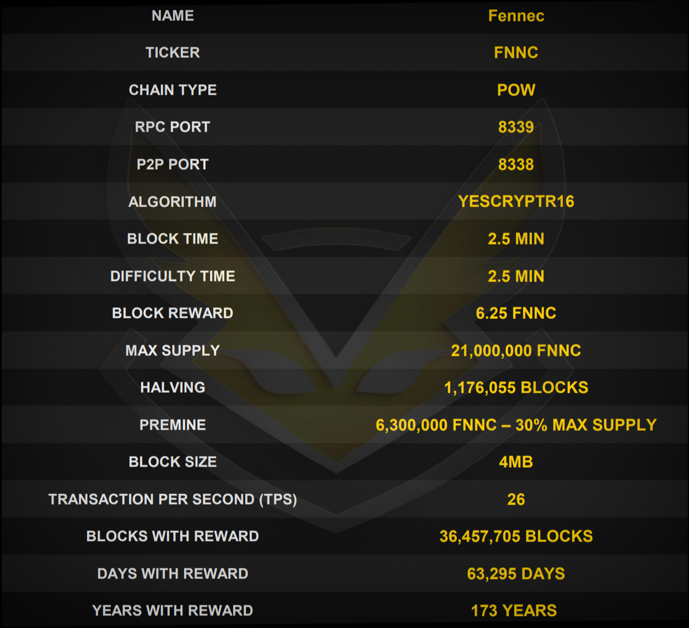
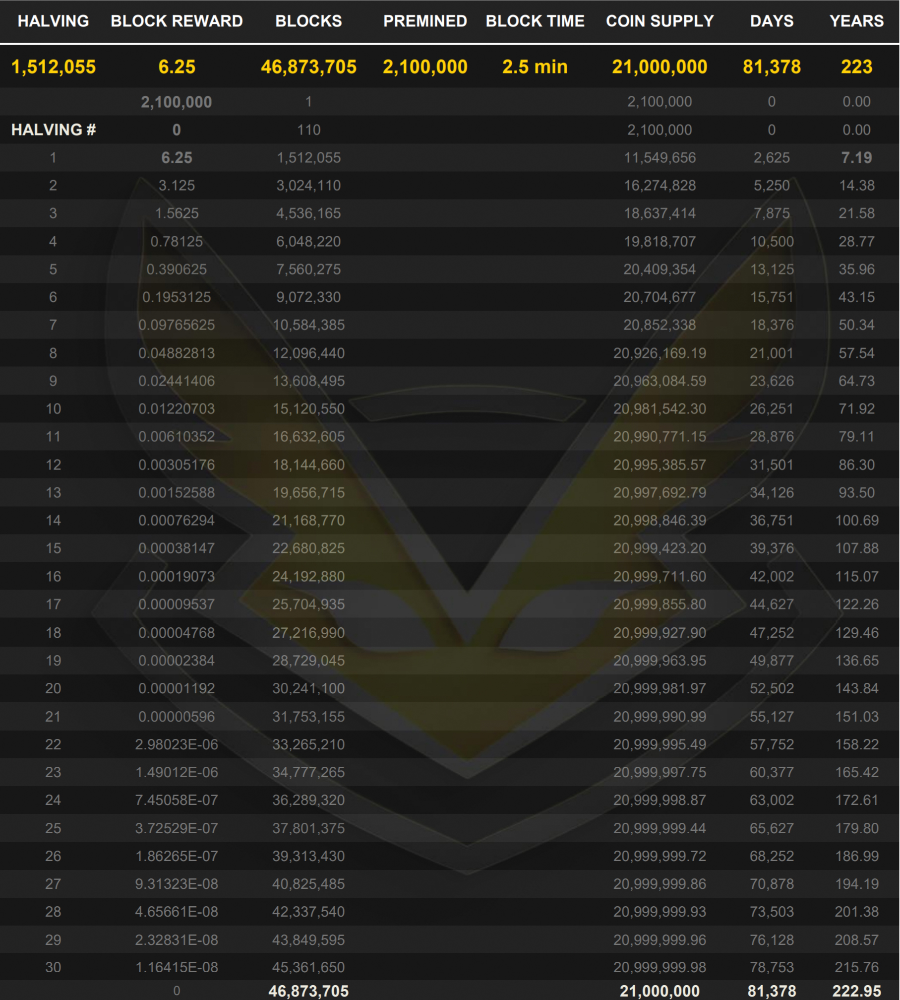
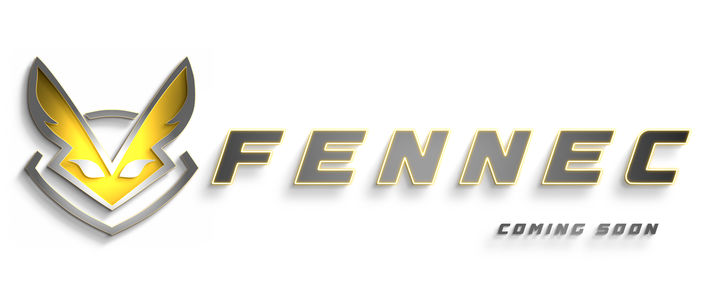



Specifications:
==================

---

• 51% attacks resistant

• Adopts Segwit and CSV technology

• Prefix: FNNC adresses start with "F"  

• Uses the "FennecDifficulty" (FD) difficulty algorithm for a more stable POW mining on the network

---

Reward Table:
==================

Links:
==================

• [Telegram - Official](https://t.me/FennecPortal)

• [Telegram - Mining](https://t.me/FennecMiningPortal)

• [Discord](https://discord.gg/HUepGGUKW4)

• [Explorer](/) (soon)

• [Website](https://fennecblockchain.com/) (soon)

• [Web Wallet](https://fennecwallet.com) (soon)

• [Mining Pool](https://mine.fennecblockchain.com) (soon)

---

License
-------

The Realm Coin is released under the terms of the MIT license. See [COPYING](COPYING) for more
information or see http://opensource.org/licenses/MIT.
